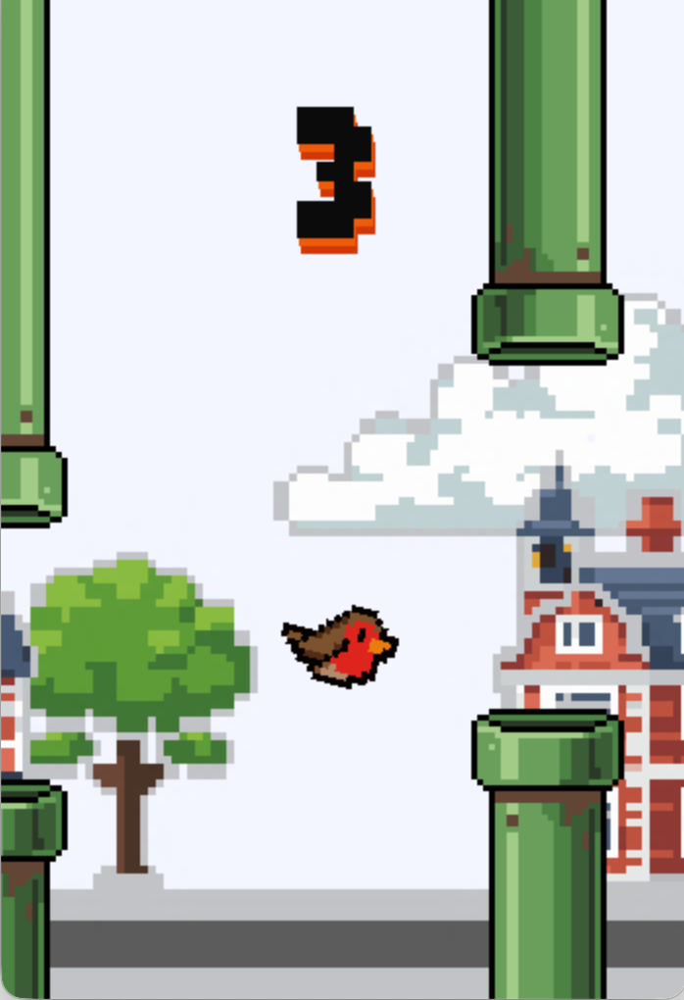

# Robin2D Samples

</img>

A collection of simple games exploring `Robin2D` API.

## Games

| Title | Screenshot | Description |
| ---- | ---- | ---- |
| RobinBird |  | RobinBird is a cross-platform arcade game inspired by Flappy Bird that demonstrates keyboard, mouse, and touch input using the `Robin2D` engine. |
