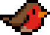
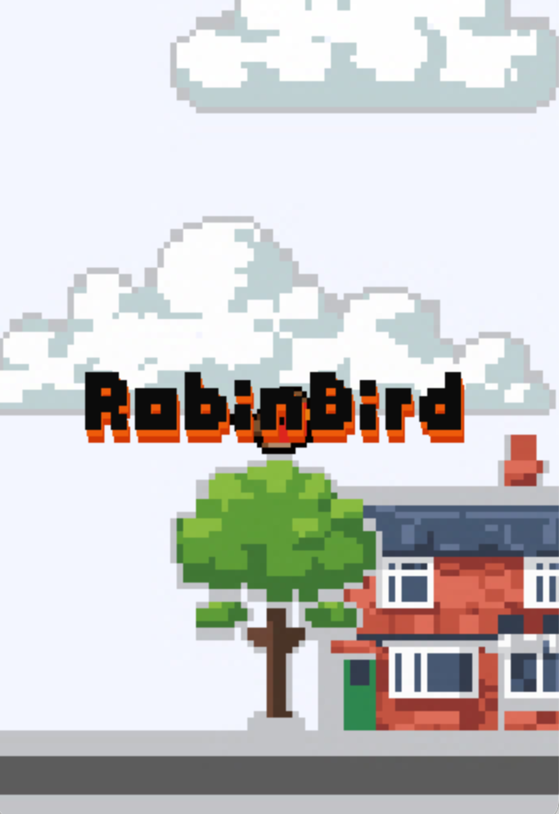
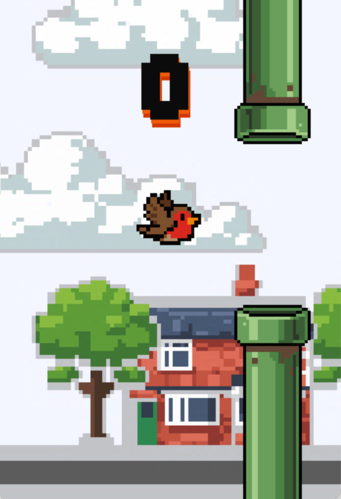

</img>

# RobinBird

RobinBird is a simple yet addictive arcade game inspired by the classic [Flappy Bird](https://en.wikipedia.org/wiki/Flappy_Bird), built to showcase the cross-platform capabilities of the `Robin2D` engine.

Players guide a bird through a series of obstacles using keyboard, mouse, or touch controls, making it an ideal example for testing input handling across desktop and mobile platforms. With lightweight mechanics, smooth physics, and responsive controls, RobinBird demonstrates how quickly fun and polished games can be created with `Robin2D` while remaining easy to understand and extend for developers.

## Screenshots

| Main screen | Gameplay | Game Over |
| ---- | ---- | ---- |
|  |  |  |

### Assets

Third party assets under different licenses.

#### Fonts

- [leapfont-bold](https://patsy-jane.itch.io/leap-font) by [Patsy](https://patsy-jane.itch.io)

#### Sounds Effects

- "Coin" by [chieuk](https://pixabay.com/users/chieuk-46505609/?utm_source=link-attribution&utm_medium=referral&utm_campaign=music&utm_content=257878) from [Pixabay](https://pixabay.com/sound-effects//?utm_source=link-attribution&utm_medium=referral&utm_campaign=music&utm_content=257878)
- "Flap" by [DRAGON-STUDIO](https://pixabay.com/users/dragon-studio-38165424/?utm_source=link-attribution&utm_medium=referral&utm_campaign=music&utm_content=478385) from [Pixabay](https://pixabay.com/sound-effects//?utm_source=link-attribution&utm_medium=referral&utm_campaign=music&utm_content=478385)
- "Bloop" by [floraphonic](https://pixabay.com/users/floraphonic-38928062/?utm_source=link-attribution&utm_medium=referral&utm_campaign=music&utm_content=186533) from [Pixabay](https://pixabay.com//?utm_source=link-attribution&utm_medium=referral&utm_campaign=music&utm_content=186533)
- "Kick" by [freesound_community](https://pixabay.com/users/freesound_community-46691455/?utm_source=link-attribution&utm_medium=referral&utm_campaign=music&utm_content=7171) from [Pixabay](https://pixabay.com//?utm_source=link-attribution&utm_medium=referral&utm_campaign=music&utm_content=7171)
